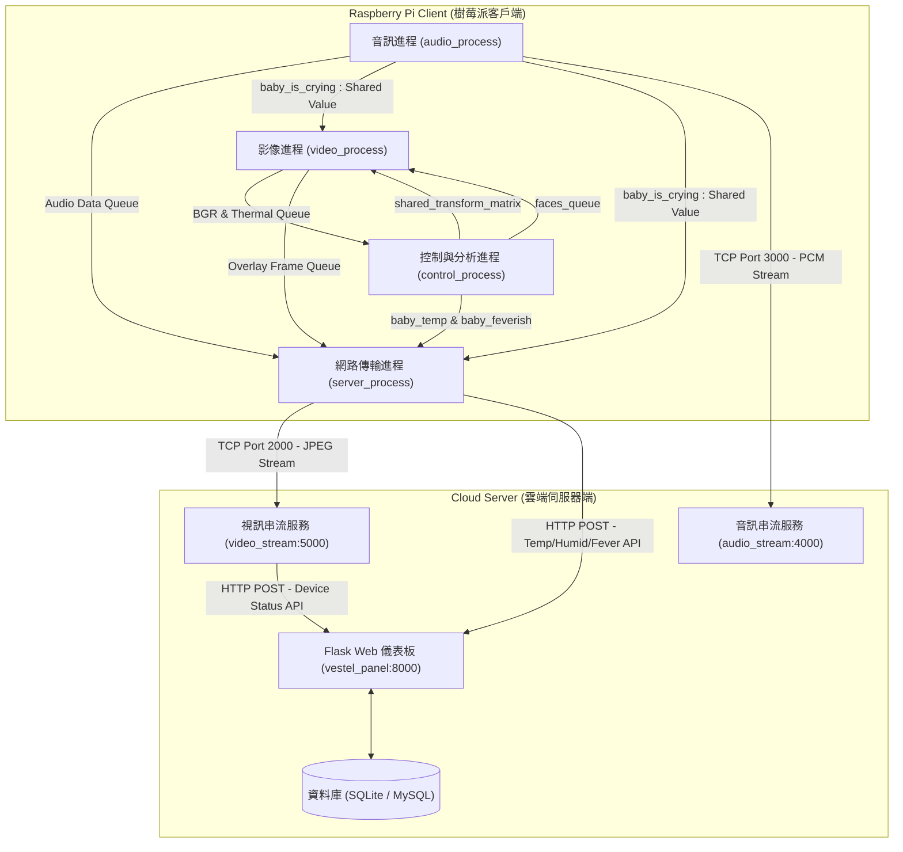

# FLIR Lepton 熱成像輔助嬰兒監視器 (Thermal-Camera-Assisted Baby Monitor)

本專案是一個基於樹莓派 (Raspberry Pi) 的智慧嬰兒監視器系統，結合了 **FLIR Lepton 熱成像相機**與**常規 BGR 相機**。系統透過多進程 (Multiprocessing) 架構，即時捕獲影像與音訊，進行影像對齊疊加、嬰兒人臉檢測與體溫量測、哭聲偵測，並將音視頻串流及環境與生理數據上傳至遠端 Flask 伺服器，提供家長一個即時的 Web 監控儀表板。

---

## 目錄

- [專案架構 (Project Architecture)](#專案架構-project-architecture)
- [模擬開發機制 (Hardware Mocking)](#模擬開發機制-hardware-mocking)
- [環境建置 (Environment Setup)](#環境建置-environment-setup)
  - [樹莓派客戶端 (Client)](#1-樹莓派客戶端-client)
  - [雲端伺服器端 (Server)](#2-雲端伺服器端-server)
- [部署與運行 (Deployment & Execution)](#部署與運行-deployment--execution)
  - [步驟一：啟動雲端伺服器](#步驟一啟動雲端伺服器)
  - [步驟二：啟動樹莓派客戶端](#步驟二啟動樹莓派客戶端)

---

## 專案架構 (Project Architecture)

系統分為兩大核心模組：**樹莓派客戶端 (`source`)** 與 **Web 雲端伺服器端 (`source_server`)**。

### 1. 系統通訊架構圖
下圖展示了樹莓派內部多進程的資料流，以及客戶端與雲端伺服器之間的 TCP/HTTP 通訊機制：



### 2. 樹莓派客戶端進程設計 (`source`)
客戶端採用 Python `multiprocessing` 模組，將不同硬體感測器的採集與處理分流至以下四個並行進程：
*   **影像進程 (video_process)**:
    *   透過 OpenCV 從 BGR 鏡頭（`/dev/video0`）捕獲即時視訊。
    *   透過 `Lepton` 驅動從 FLIR Lepton 模組（`/dev/spidev0.1`）捕獲原始熱成像幀（80x60）。
    *   利用控制進程提供的仿射變形矩陣 (Transform Matrix)，將熱成像影像 warp 對齊至 BGR 影像。
    *   將對齊後的熱成像幀套用 `COLORMAP_JET` 偽彩色，並與 BGR 影像進行混合疊加（比例 0.25 : 0.75），寫入 `frame_queue` 送出。
*   **音訊進程 (audio_process)**:
    *   使用 `PyAudio` 連接聲卡輸入端，採集即時音訊。
    *   透過音訊 RMS 分貝值與 peak_count 演算法偵測嬰兒是否正在哭鬧（`baby_is_crying`）。
    *   當偵測到嬰兒哭鬧時，即時在本地端自動撥放安撫音樂 (`Baby-sleep-music.wav`)。
    *   將即時音訊數據寫入 socket 連線發送至伺服器。
*   **控制與分析進程 (control_process)**:
    *   **人臉偵測**：定時啟動 OpenCV Haar Cascade Classifier (`haarcascade_frontalface_default.xml`) 從 BGR 幀中識別嬰兒臉部位置。
    *   **溫度換算**：根據臉部區域對應的熱成像像素，計算嬰兒最高體溫；若未偵測到人臉，則使用預設 ROI（熱成像中央區域）。計算公式利用主板晶片溫度 (`AUX_temp`) 進行環境補償與 piecewise-linear 查表校正。
    *   **環境監控**：經由串口（`/dev/ttyUSB0`）連接並讀取 DHT-22 溫濕度感測器的數據。
    *   **矩陣計算**：定時執行影像特徵匹配與對齊演算法，更新 `shared_transform_matrix`。
*   **網路傳輸進程 (server_process)**:
    *   接收 `frame_queue` 影像，將 JPEG 圖像傳送至伺服器 Port 2000。
    *   定時（30秒間隔）向伺服器 API（Port 8000）發送環境溫濕度與體溫數據。
    *   定時（5秒間隔）向伺服器 API 發送哭聲/發燒警報通知狀態。

### 3. 雲端伺服器端設計 (`source_server`)
伺服器端由三個相對獨立的服務組成：
*   **Flask Web 儀表板 (`vestel_panel`)**:
    *   Port 8000。基於 Flask 框架與 Flask-SQLAlchemy 實現。
    *   維護使用者帳戶、綁定監視器設備。
    *   提供 API endpoint (`/api/data`, `/api/notification`, `/api/updateDeviceStatus`) 接收樹莓派的上報。
    *   支援 WebPush 訂閱，在發生嬰兒發燒 (體溫 > 33.5°C 且持續) 或哭鬧時，發送瀏覽器即時通知。
*   **音訊串流伺服器 (`audio_stream`)**:
    *   Port 4000 (HTTPS/HTTP)。背後開啟 TCP 3000 埠。
    *   接收來自樹莓派的 PCM 音訊流，並在網頁端請求 `/wav` 時，動態封裝為符合 WAV 協議頭的音訊串流返回瀏覽器播放。
*   **視訊串流伺服器 (`video_stream`)**:
    *   Port 5000 (HTTPS/HTTP)。背後開啟 TCP 2000 埠。
    *   接收樹莓派發送的混合影像幀。當網頁端請求 `/video_feed` 時，利用 MJPEG (`multipart/x-mixed-replace`) 格式實時串流至網頁前端。若客戶端斷開，則返回預設的 `RefreshImage.jpg`。

---

## 模擬開發機制 (Hardware Mocking)

為了能在沒有樹莓派或沒有實體硬體感測器（如 Lepton 攝像頭、DHT-22 溫濕度計、音效卡）的 PC/Mac 開發環境下順利進行調試，本專案提供內建的 Mock 機制：
*   **視訊模擬 (`MockVideoCapture` / `MockLepton`)**：若無 `/dev/video0` 或 SPI 連線，自動生成隨機像素之 BGR 與熱成像圖案。
*   **音訊模擬 (`MockAudioStream`)**：在無麥克風/揚聲器的環境中模擬音訊讀寫，避免 PyAudio 拋出啟動異常。
*   **網路模擬 (`MockSocket`)**：當伺服器尚未啟動或網路不通時，模擬 socket 讀寫，防止程式崩潰。
*   **感測器模擬 (`MockSerial`)**：若 `/dev/ttyUSB0` 未連接，自動產生環境溫濕度模擬數據。

這使得開發者在 PC 端執行 `python source` 時，可以直接觀察多進程通訊與畫面合成邏輯。

---

## 環境建置 (Environment Setup)

### 1. 樹莓派客戶端 (Client)

#### 硬體腳位配置
若連接實體 FLIR Lepton 模組，請使用以下 Raspberry Pi GPIO 腳位連接：

| FLIR Lepton 腳位 | 樹莓派 GPIO 功能 / 腳位 |
| :--- | :--- |
| **GND** | Ground (接地) |
| **VIN** | 3.3V Power (電源) |
| **CS** | SPI0_CE1_N (GPIO 7) |
| **MISO** | SPI0_MISO (GPIO 9) |
| **CLK** | SPI0_SCLK (GPIO 11) |
| **SDA** | I2C1_SDA (GPIO 2) |
| **SCL** | I2C1_SCL (GPIO 3) |

*註：DHT-22 感測器透過 Serial 轉 USB 模組插在 `/dev/ttyUSB0`。*

#### 軟體依賴安裝
1.  **啟用 SPI 與 I2C**：
    進入樹莓派終端機，輸入 `sudo raspi-config`，在 **Interfacing Options** 中啟用 **SPI** 與 **I2C**。重啟樹莓派。
2.  **安裝系統庫依賴** (以 Debian/Raspbian 為例)：
    ```bash
    sudo apt-get update
    sudo apt-get install -y portaudio19-dev python3-dev qt4-dev-tools build-essential
    ```
3.  **安裝 Python 套件**：
    在 `source` 目錄下建立並啟動虛擬環境，然後安裝必備庫：
    ```bash
    cd source
    python3 -m venv venv
    source venv/bin/activate
    pip install --upgrade pip
    pip install opencv-python numpy scipy scikit-image pyaudio adafruit-dht
    ```
4.  **編譯 Lepton C++ 驅動程式**：
    ```bash
    cd control/raspberrypi_video
    qmake && make
    # 這會編譯出用於獲取 FPA 晶片溫度的執行檔 'AUX_temp'。
    # 確保 pi 使用者有 i2c 權限，若無，執行：sudo usermod -aG i2c pi
    ```

### 2. 雲端伺服器端 (Server)

1.  **安裝 Python 依賴**：
    進入 `source_server/vestel_panel` 目錄，安裝相關套件：
    ```bash
    cd source_server/vestel_panel
    pip install -r requirements.txt
    pip install pywebpush  # 用於發送 WebPush 通知
    ```
2.  **資料庫初始化**：
    *   **預設 SQLite 配置**：
        在 `source_server/vestel_panel` 中，直接執行 Flask-Migrate 初始化：
        ```bash
        export FLASK_APP=vestelpanel.py
        flask db upgrade
        ```
    *   **使用 MySQL 導入**：
        若要將資料庫佈署於 MySQL 伺服器，請將 `vestelpanel.sql` 備份檔導入至 MySQL：
        ```bash
        mysql -u [username] -p [database_name] < ../../vestelpanel.sql
        ```
        導入後，修改 `source_server/vestel_panel/config.py` 中的 `SQLALCHEMY_DATABASE_URI` 為您的 MySQL 連線字串（或於 `.env` 中設定 `DATABASE_URL`）。

---

## 部署與運行 (Deployment & Execution)

### 步驟一：啟動雲端伺服器

建議在一台擁有固定公網 IP (如本例中硬編碼的 `167.99.215.27`，部署時可視情況修改為實際 IP 或 Domain) 的 Linux 伺服器上部署。

1.  **啟動 Web 儀表板 (`vestel_panel`)**:
    ```bash
    cd source_server/vestel_panel
    # 設定環境變數或建立 .env 檔案
    export FLASK_APP=vestelpanel.py
    flask run --host=0.0.0.0 --port=8000
    ```
2.  **啟動視訊串流伺服器 (`video_stream`)**:
    ```bash
    cd source_server/video_stream
    python main4.py
    # 影像串流服務將運行在 Port 5000，並開啟 TCP Port 2000 傾聽樹莓派連入。
    ```
3.  **啟動音訊串流伺服器 (`audio_stream`)**:
    ```bash
    cd source_server/audio_stream
    python soundmain2.py
    # 音訊串流服務將運行在 Port 4000，並開啟 TCP Port 3000 傾聽樹莓派連入。
    ```

*註：在正式環境中，建議使用 Nginx 作為反向代理，並以 Systemd 服務或 Gunicorn 來常駐運行這三個 Flask 應用。若要啟用 HTTPS 串流，需在 `soundmain2.py` 與 `main4.py` 中配置 SSL 憑證路徑。*

### 步驟二：啟動樹莓派客戶端

1.  **IP 配置**：
    在專案根目錄建立 `.env` 檔案（或直接修改已存在的 `.env` 檔案），並設定伺服器的 IP 位址：
    ```env
    SERVER_IP=192.168.11.16
    ```
2.  **運行主程式**：
    在樹莓派終端機中，啟動多進程系統：
    ```bash
    cd source
    source venv/bin/activate
    python __main__.py
    ```

系統啟動後，多個進程將同步初始化。您可以在網頁瀏覽器中拜訪 `http://[your-server-ip]:8000` 登入儀表板，即時點擊視訊（Port 5000）與音訊（Port 4000）串流連結來遠端照看您的嬰兒。
