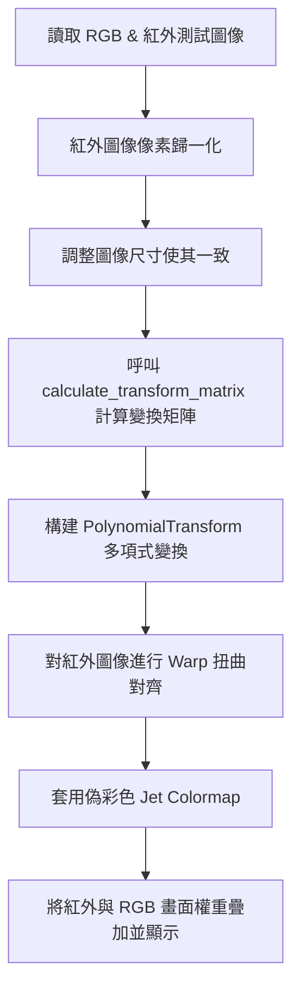

# test_script_alignment.py 說明文檔

`test_script_alignment.py` 是一個用於開發與偵錯 **RGB（彩色）圖像與 Thermal（紅外線/熱成像）圖像對齊（Image Alignment / Registration）** 演算法的實驗性測試腳本。

---

## 1. 核心功能與工作流程

該腳本的主要目的在於驗證如何將不同解析度、不同視角的紅外線相機畫面與彩色相機畫面進行精確的空間對齊，主要步驟如下：

### 詳細步驟說明
1. **讀取測試圖像**：自定義本地路徑讀取 BGR 彩色圖與 Thermal 紅外圖。
2. **圖像預處理與縮放**：
   * 使用 `cv2.normalize` 將紅外圖像像素值歸一化至 `[0, 255]`。
   * 通過 `skimage.transform.pyramid_reduce` 將 RGB 圖像降採樣，並通過 `pyramid_expand` 將紅外圖像升採樣，使兩者解析度與物理尺度基本一致。
3. **計算變換矩陣**：調用專案內部的 `control.transform_matrix` 模組中的 `calculate_transform_matrix` 方法，對比兩張圖像的特徵並計算出變換矩陣。
4. **多項式扭曲（Polynomial Warp）**：
   * 建立多項式變換模型 `transform.PolynomialTransform`。
   * 使用 `transform.warp` 對紅外圖像進行幾何變換，使其疊加到彩色圖像的視角上。
5. **結果疊加與顯示**：
   * 對扭曲後的紅外圖套用 `COLORMAP_JET`（偽彩色，即常見的紅藍熱力圖）。
   * 使用 `cv2.addWeighted` 將彩色熱力圖（權重 30%）與降採樣後的 RGB 圖像（權重 70%）融合，最後用 `matplotlib.pyplot` 顯示對齊效果。

---

## 2. 實驗性/已注釋的演算法嘗試

腳本的後半部分包含大量已注釋的程式碼，記錄了開發過程中嘗試過的其他圖像配準思路：

* **全變分去噪（Total-Variation Denoising）**：
  * 使用 `denoise_tv_chambolle` 對 RGB 亮度通道及紅外圖像進行去噪，去除無用細節，保留邊緣。
* **Canny 邊緣檢測閥值自適應優化**：
  * 利用 `scipy.optimize.fmin_powell` 尋求最佳的 Canny 雙閥值，使邊緣檢測點的數量符合預設比例（如圖像總像素的 4%），以提高對齊特徵點的品質。
* **分區平移配準（Sub-region Translation Registration）**：
  * 將圖像沿水平方向分割成多個子區域（例如 `hsplit`）。
  * 調用 `feature.register_translation`（互相關配準）計算每個區域在水平與垂直方向的偏移量。
  * 利用 `sklearn` 的 `LinearRegression` 及多項式特徵，擬合出代表畸變特性的二次曲線，再估算整體的多項式變換矩陣。

---

## 3. 注意事項

* **硬編碼路徑（Hardcoded Paths）**：
  * 腳本內包含大量的 Windows OneDrive 絕對路徑（例如 `C:\Users\erena\OneDrive\...`），在 Linux 環境（如樹莓派）下直接運行會報 `FileNotFoundError`。若要運行，需修改相關圖像與 Python 模組搜索路徑。
* **依賴庫**：
  * 運行此腳本需要安裝以下依賴：`opencv-python`、`numpy`、`scikit-image`、`numba`、`scipy`、`matplotlib`、`scikit-learn`。
